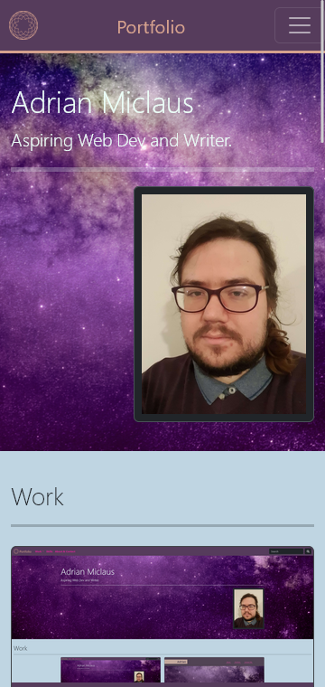
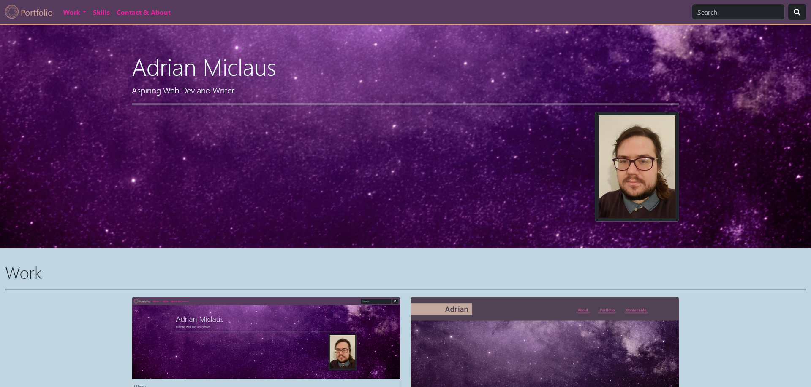

# Bootstrap Portfolio

## Description
This webpage exists to showcase my portfolio of projects, currently it contains a link to itself, a link to the previous attempt at a portfolio and three placeholders, with intent to update it and replace these placeholders with links to actual projects once I have made them.

Throughout this project I have learned to make use of various bootstrap components in order to stylise a webpage and have made myself more familiar with the bootstrap website.

### Mobile

### Desktop

This website can be found on [Github Pages.](https://applepieorchard.github.io/bootstrap-portfolio/)

## Installation

N/A

## Usage

There is little required to use this webpage, browse it as you see fit. If you click on the placeholders they will scroll you to them, sometimes this results in no change. If you click on the first project, you will simply reopen this website in a new tab, clicking on the second project will take you to that website in a new tab.

## Credits

This project uses various components from the [getbootstrap website](https://getbootstrap.com/).

## Liscense

This Project is subject to the [MIT License.](LICENSE)